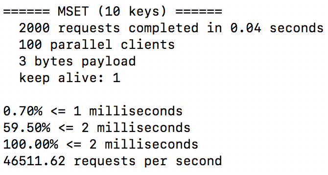

# redis-benchmark详解

redis-benchmark可以为Redis做基准性能测试。

* -c（client）代表客户端并发数量。

* -n（num）代表客户端请求总量（默认100000）。

例如redis-benchmark -c 100 -n 2000代表100个客户端同事请求Redis，一共执行2000次。

上面一共执行了2000次mset操作，每次设置10个键，每个请求数据大小是3字节，0.7%的命令执行时间小余等于1毫秒，每秒可以处理46511.62次mset设置10个键的请求。

* -q选项仅显示requests per second信息。（每秒可以处理的请求次数）

* -r（random）选项向Redis插入更多的随机键。此选项会在key，counter键上加一个12位的后缀，比如-r 1000代表只对后四位做随机处理，不是随机数的个数。
