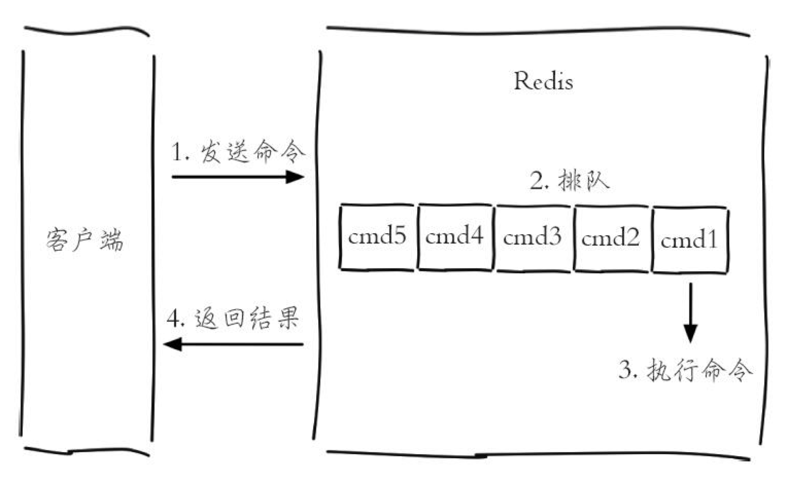

# 慢查询分析

慢查询日志就是系统在命令执行前后计算每条命令的执行时间，当超过阀值，就将这条命令的相关信息（例如：发生时间，耗时，命令的详细信息），记录下来。

Redis每执行一条命令分为下面4个部分：

**慢查询只统计步骤3，所以没有慢查询，不代表客户端没有超时问题。**

#### 慢查询配置

* slowlog-log-slower-than是预设阀值。单位是微秒（1秒=1000毫秒=1000000微秒）。默认值10000，当值为0时会记录所有命令，当值小余0时不会记录任何命令。

* slowlog-max-len是慢查询日志最多存储多少条。Redis使用了一个列表来存储慢查询日志，slowlog-max-len就是列表的长度，当列表处于最大长度时，最早插入的元素将会移除。

#### 相关命令

* slowlog get [n] 获取慢查询日志。

* slowlog len 获取慢查询日志当前长度。

* slowlog reset 清空慢查询日志。

#### 最佳实践

* slowlog-max-len配置建议：线上建议调大慢查询列表，记录慢查询时Redis会对长命令做截断操作，不会占用大量内存，增大慢查询列表可以减缓慢查询被剔除的可能性。

* slowlog-log-slower-than配置建议，默认超过10000微秒为慢查询，需根据并发量调整该值。由于Redis采用单线程架构，对于高流量场景，如果命令执行实践在1毫秒以上，那么Redis最多可支撑OPS不到1000，因此高OPS场景建议设置为1000微秒。

* 慢查询只记录命令执行时间，不包括命令排队时间和网络传输时间。因为命令执行排队机制，慢查询会导致其他命令级联阻塞，因此当客户端出现超时，需要检查对应的时间节点是否有慢查询，分析是否是慢查询导致的级联阻塞。

* 慢查询日志是一个先进先出的队列，慢查询较多可能会丢失，可以使用slowlog get存储到MySQL等持久化存储。
